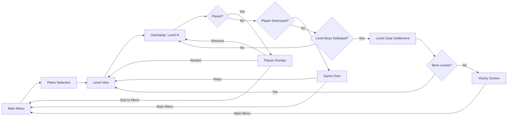
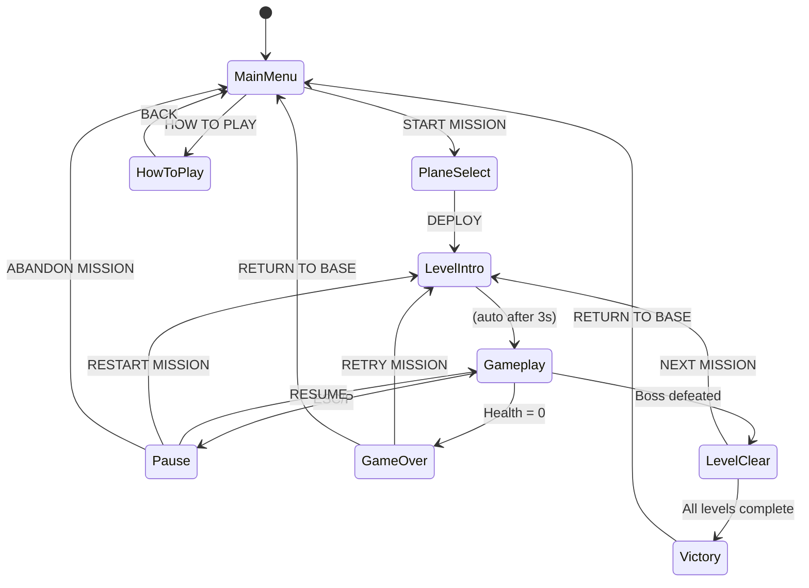

# StarForge Strike — Product Vision & User Experience SSOT

## 1. Product Vision & Executive Summary

### Elevator Pitch
StarForge Strike is a bullet-hell vertical shooter where players pilot a cosmic fighter through an endless, looping high-tech interstellar military base. With 2D gameplay rendered in 3D, players dodge dense bullet patterns, unleash devastating attacks, and battle through three visually distinct levels against elite squadrons and massive bosses.

### Core Design Goals & Value Proposition
1. **Intense Bullet-Hell Combat:** Dense, readable bullet patterns that reward precise movement and pattern memorization.
2. **Distinct Player Identity:** Three visually and mechanically unique fighters that dramatically change playstyle.
3. **Strategic Loadout Depth:** Five wingman types and per-plane power-up paths create meaningful build choices.
4. **Cinematic Presentation:** Flashy effects, dramatic entrances, and a cold, stern military aesthetic that feels premium.

---

## 2. Core User Journey & Primary Workflow

### Core Loop Diagram

### Primary User Stories
- **As a player,** I want to choose from three distinct fighters so that I can match my playstyle.
- **As a player,** I want to collect POWER pickups so that my attacks become progressively more devastating.
- **As a player,** I want to collect wingmen so that I have additional firepower covering different angles.
- **As a player,** I want to face varied enemy types and bosses so that each level feels fresh and challenging.
- **As a player,** I want clear feedback on my performance so that I know how well I am doing.

---

## 3. Functional Feature Breakdown

### Feature Domain A: Navigation & UI Screens

#### Main Menu
- **Layout:** Sci-fi military command center aesthetic. Dark background with animated starfield and base silhouette. Title "STARFORGE STRIKE" in bold, angular metallic font with subtle glow.
- **Options:**
  - "START MISSION" — begins plane selection.
  - "HOW TO PLAY" — opens controls and mechanics overview.
- **Visual Behavior:** Title pulses with a slow energy wave. Menu options highlight with a cyan border on hover. Background slowly pans to convey depth.

#### Plane Selection Screen
- **Layout:** Three fighter holograms displayed side-by-side, each rotating slowly on a pedestal. Player can cycle selection with A/D or Left/Right arrows. Confirmation with Enter/Space.
- **Plane Cards Show:** Name, silhouette, brief description of attack style, and a live preview of the bullet pattern firing upward.
- **Selected plane** is highlighted with a bright cyan ring and enlarged scale.
- **UI Text:**
  - Title: "SELECT FIGHTER"
  - Plane names: "VANGUARD", "PHANTOM", "TITAN"
  - Confirm button: "DEPLOY"

#### Pause Overlay
- **Trigger:** ESC or P key during gameplay.
- **Options:**
  - "RESUME" — returns to gameplay.
  - "RESTART MISSION" — restarts current level.
  - "ABANDON MISSION" — returns to main menu.
- **Visual:** Dark translucent overlay with blurred background. Options appear with staggered fade-in animation.

#### Level Clear Settlement Screen
- **Trigger:** Boss defeated and all remaining enemies cleared.
- **Content:**
  - "MISSION COMPLETE" header.
  - Level name.
  - Score breakdown: enemies destroyed, boss bonus, pickup bonus, time bonus.
  - Total score.
  - "NEXT MISSION" button (or "MISSION COMPLETE — ALL LEVELS CLEARED" on final level).
- **Visual:** Confetti-like particle burst of cyan and orange sparks. Score numbers count up with a ticking animation.

#### Game Over Screen
- **Trigger:** Player health reaches zero.
- **Content:**
  - "MISSION FAILED" header in red.
  - Level name and score achieved.
  - "RETRY MISSION" button — restarts current level.
  - "RETURN TO BASE" button — returns to main menu.
- **Visual:** Screen desaturates with a red vignette pulse. Explosion debris drifts across the background.

#### Victory Screen (Final)
- **Trigger:** All 3 levels completed.
- **Content:**
  - "ALL MISSIONS COMPLETE" header in gold.
  - Total score across all levels.
  - "RETURN TO BASE" button.
- **Visual:** Full-screen golden particle shower. Player fighter flies across the screen in a victory loop.

### Feature Domain B: Core Gameplay Mechanics

#### Player Movement & Shooting
- **Controls:** A/D = left/right, W/S = up/down. Movement is smooth with slight acceleration and deceleration for a weighty feel.
- **Auto-Fire:** Player fires continuously without input. Bullets spawn from the nose of the fighter and travel upward.
- **Movement Bounds:** Player is confined to the lower 60% of the screen. Horizontal bounds are the screen edges with a small margin.
- **Collision:** Player hitbox is small (approximately 20% of visual size) for fair bullet-hell gameplay.

#### Player Health & Lives
- Player has 3 health points (displayed as shield segments in HUD).
- Each hit removes 1 health point and triggers a 2-second invincibility period (player blinks).
- At 0 health, the player explodes and the Game Over screen appears.
- No health regeneration during a level.

#### POWER Pickup
- **Visual:** Cyan hexagonal crystal with a lightning bolt icon. Pulsing glow.
- **Effect:** Increases the player's power level by 1 (max 5 levels).
- **Per-Plane Power Progression:**
  - **VANGUARD:** Increases bullet count (1 → 2 → 3 → 4 → 5 parallel streams).
  - **PHANTOM:** Increases scatter angle (narrow → wide spread of 3 → 5 → 7 → 9 bullets).
  - **TITAN:** Increases bullet width and damage (single wide beam that grows thicker).
- **At Max Power:** Pickup converts to +500 score with a golden flash and "BONUS +500" floating text.

#### Wingman Pickup
- **Visual:** Silver drone module with a glowing blue core. Rotating slowly.
- **Effect:** Adds a wingman to the player's squadron. Wingmen follow behind the player in a trailing formation.
- **Max Capacity:** 5 wingmen.
- **When Full:** Oldest wingman is removed (with a small despawn effect) and the new one is added.
- **Wingman Types (5):**
  1. **PULSER** — Fires rapid small bullets in a straight line parallel to player.
  2. **LANCE** — Fires a continuous thin laser beam that pierces enemies.
  3. **SEEKER** — Fires homing missiles that track the nearest enemy.
  4. **FLARE** — Fires spread shots in a fan pattern (3 bullets at 30-degree angles).
  5. **BARRAGE** — Fires a dense burst of 5 bullets in a narrow cone.
- **Formation:** Wingmen position in an arc behind the player, evenly spaced. They mirror the player's horizontal movement with a slight delay for a fluid trailing effect.

#### Enemy Design

**Basic Enemies (3 types):**

| Name | Visual Description | Attack Pattern | Health | Size |
|------|-------------------|----------------|--------|------|
| **DRONE** | Small angular drone, dark gray with red sensor eye | Fires 1 slow bullet straight down | 1 hit | Small |
| **RAIDER** | Medium fighter with swept wings, dark blue with orange accents | Fires 3-bullet fan spread downward | 2 hits | Medium |
| **SENTRY** | Hovering turret with rotating barrel, gunmetal gray | Fires aimed 2-bullet burst at player position | 3 hits | Medium |

**Elite Enemies (4 types):**

| Name | Visual Description | Attack Pattern | Health | Size |
|------|-------------------|----------------|--------|------|
| **REAPER** | Large angular fighter with glowing red core | Fires spiral pattern of 6 bullets rotating outward | 8 hits | Large |
| **WARDEN** | Heavy armored unit with shield plating | Fires 5-bullet spread plus occasional aimed laser | 12 hits | Large |
| **HARBINGER** | Twin-hulled bomber with missile pods | Launches 3 homing missiles that track player | 10 hits | Large |
| **OVERLORD** | Command ship with rotating turret ring | Fires alternating ring bursts and aimed streams | 15 hits | Very Large |

**Bosses (3 types):**

| Boss | Level | Visual Description | Attack Phases | Health |
|------|-------|-------------------|---------------|--------|
| **IRONCLAD** | Level 1 | Massive rectangular dreadnought with layered armor plates and a central cannon | Phase 1: Wide spread shots. Phase 2 (below 50%): Adds aimed laser sweeps. Phase 3 (below 25%): Fires rotating spiral patterns | 200 |
| **VOID REAVER** | Level 2 | Organic-mechanical hybrid with tentacle-like appendages and a pulsing void core | Phase 1: Homing missile volleys. Phase 2 (below 50%): Adds radial bullet bursts. Phase 3 (below 25%): Fires alternating spiral and aimed patterns | 300 |
| **SOVEREIGN** | Level 3 | Colossal flagship with a glowing command spire and multiple turret banks | Phase 1: Multi-directional bullet walls. Phase 2 (below 50%): Adds targeted laser barrages. Phase 3 (below 25%): Combines all patterns with increased speed | 500 |

#### Level Design

**Level 1: "TITAN GATE"**
- **Visual Style:** Cold steel corridors with cyan energy conduits running along walls. Harsh overhead lighting with long shadows. Occasional red warning lights.
- **Enemy Flow:** DRONEs in waves of 5-8 → RAIDERs introduced in mixed waves → SENTRYs appear as stationary threats → Elite REAPERs appear at midpoint → WARDENs in final approach → Boss IRONCLAD.
- **Atmosphere:** Sterile, mechanical, and imposing. The corridor feels vast and empty despite the combat.

**Level 2: "VOID REACTOR"**
- **Visual Style:** Organic-tech hybrid with pulsing purple membranes and exposed energy cores. Bioluminescent growths along walls. Flickering emergency lights.
- **Enemy Flow:** RAIDERs and SENTRYs in aggressive mixed waves → HARBINGERs introduced as priority targets → REAPERs and WARDENs in coordinated assaults → Boss VOID REAVER.
- **Atmosphere:** Unsettling and alien. The corridor feels alive and hostile.

**Level 3: "SOVEREIGN CORE"**
- **Visual Style:** Pristine white and gold command deck with holographic displays and massive energy pillars. Clean, bright, and imposing.
- **Enemy Flow:** All enemy types in escalating combinations → OVERLORDs appear as mini-bosses → Final gauntlet of mixed elites → Boss SOVEREIGN.
- **Atmosphere:** Grand and final. The heart of the military base, radiating power and authority.

#### Level Structure & Modular Segments
- Each level is composed of looping modular corridor segments that connect head-to-tail infinitely.
- Segments are dynamically generated ahead of the player and recycled behind them.
- Each segment contains: background geometry, enemy spawn points, and optional pickup placements.
- Segment types vary: straight corridor, slight curve, chamber with pillars, junction with side passages.
- The level difficulty curve is defined by the sequence of segment types and enemy spawn configurations.

### Feature Domain C: Feedback Systems & Visual Polish

#### Hit Effects
- **Enemy Hit:** White flash on the enemy model, small cyan particle burst at impact point.
- **Enemy Destroyed:** Explosion with orange and yellow particles, expanding shockwave ring, brief screen shake (intensity scales with enemy size).
- **Player Hit:** Red flash on screen edges, shield break effect with blue shards, 2-second invincibility blink.

#### Explosion Effects
- Small (basic enemies): 10-15 particles, short duration.
- Medium (elite enemies): 25-40 particles, shockwave ring, 0.2s screen shake.
- Large (bosses): 60+ particles, multiple shockwave rings, 0.5s screen shake, slow-motion effect for 1 second.

#### Player Entrance Scene
- Level starts with the player fighter performing a dramatic fly-in: entering from the bottom of the screen with a speed trail, pulling up to the starting position, and firing a celebratory burst.

#### Enemy Entrance Scenes
- **Basic enemies:** Warp-in effect with a cyan flash and expanding ring.
- **Elite enemies:** Dramatic warp-in with a larger flash, screen shake, and a brief pause in enemy fire.
- **Bosses:** Warning banner "WARNING: HEAVY HOSTILE DETECTED" with a red flashing border, followed by a slow descent into position with a massive energy discharge.

#### Pickup Effects
- Pickups drift downward slowly with a gentle bobbing motion.
- When within a certain radius of the player, pickups accelerate toward the player (magnet effect).
- On collection: bright flash, floating score text, and a satisfying "pop" particle burst.

#### Background & Atmosphere
- Parallax scrolling: background layers move at different speeds to create depth.
- Ambient particles: floating dust, energy motes, and sparks that drift through the corridor.
- Dynamic lighting: subtle color shifts based on level theme and combat intensity.

#### Screen Effects
- **Screen Shake:** Triggered by explosions, boss attacks, and player hits. Magnitude scales with event intensity.
- **Hit Stop:** Brief (50-100ms) freeze frame on boss kills and player death for dramatic impact.
- **Vignette:** Subtle darkening at screen edges that intensifies during boss fights.

---

## 4. UX / UI Navigation & Screen State Flow

---

## 5. Scope Boundaries & Constraints

### In-Scope (v1 Release)
- Single-player, keyboard-controlled gameplay (A/D/W/S movement, ESC/P pause).
- Three selectable player fighters with distinct visuals and attack patterns.
- Five wingman types with unique attack behaviors.
- POWER pickup system with per-plane progression and max-level score conversion.
- Three basic enemy types, four elite enemy types, and three bosses.
- Three levels with distinct visual themes and enemy flow configurations.
- Looping modular level segments with dynamic generation and recycling.
- Bullet recycling system for performance.
- All UI screens: main menu, plane selection, pause, level clear, game over, victory.
- Flashy visual effects: hit effects, explosions, entrance scenes, screen shake, particles.
- Score tracking with per-level breakdown and total accumulation.

### Out-of-Scope (Strict Non-Goals)
- **NO audio/sound effects or music** — visual feedback only.
- **NO online features** — no multiplayer, leaderboards, or cloud saves.
- **NO save/load system** — progression resets on application close.
- **NO mobile/touch controls** — keyboard only.
- **NO procedurally generated levels** — hand-crafted modular segments with fixed configurations.
- **NO upgrade shop or meta-progression between runs** — power and wingmen reset each run.
- **NO difficulty selection** — fixed difficulty curve per level.
- **NO additional levels beyond the three specified.**
- **NO additional player planes, wingmen, enemies, or bosses beyond those specified.**

---

## 6. Game Rules & Edge Cases

### Scoring Rules
- **Basic enemy destroyed:** 100 points.
- **Elite enemy destroyed:** 500 points.
- **Boss destroyed:** 5000 points.
- **POWER pickup at max power:** +500 points.
- **Level clear bonus:** 1000 points per remaining health point.
- **Time bonus:** 100 points per 10 seconds remaining under a level time par (par times: Level 1 = 5 min, Level 2 = 7 min, Level 3 = 9 min).

### Edge Cases
- **Wingman full + new pickup:** Oldest wingman despawns with a small effect, new wingman joins. No score penalty.
- **Player at max power + POWER pickup:** Pickup converts to score bonus with visual feedback.
- **Player death during boss fight:** Game Over triggers immediately. Boss health resets on retry.
- **Pause during boss entrance:** Boss entrance animation pauses and resumes correctly.
- **Multiple enemies destroyed simultaneously:** All score values are awarded; explosion effects stack.
- **Player at screen edge:** Movement is clamped; no collision with level geometry.
- **Wingmen destroyed:** Wingmen cannot be destroyed by enemy fire. They persist until replaced.
- **Boss defeated while wingmen active:** Wingmen remain for the level clear screen and carry to the next level.
- **Level restart:** All pickups, power level, wingmen, and score reset to initial state for that level.